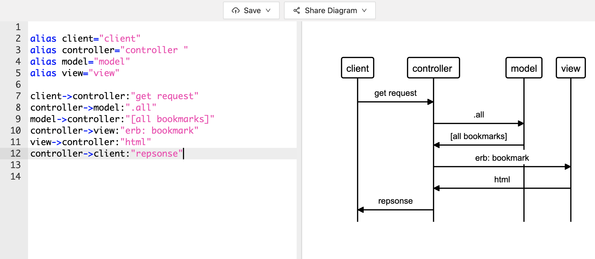

As a user,
So I can remember what I’ve bookmarked already,
I’d like to see a list of ALL my bookmarks
git 
As a user,
So I can save a page I’d like to see later
I’d like to add a new page to bookmarks

As a user,
So I can keep my list short
I’d like to delete bookmarks

As a user,
So I can everything current
I’d like to update my bookmarks

As a user,
So I can know more info about the bookmarks
I’d like to leave comment on bookmarks

As a user,
So I can organise my bookmarks
I’d like to tag bookmarks into categories

As a user,
So I can search through my bookmarks
I’d like to be able to filter through my bookmarks by tag

As a user,
So I know other users won’t mess with my bookmarks
I’d like to only be able to manage my own bookmarks

